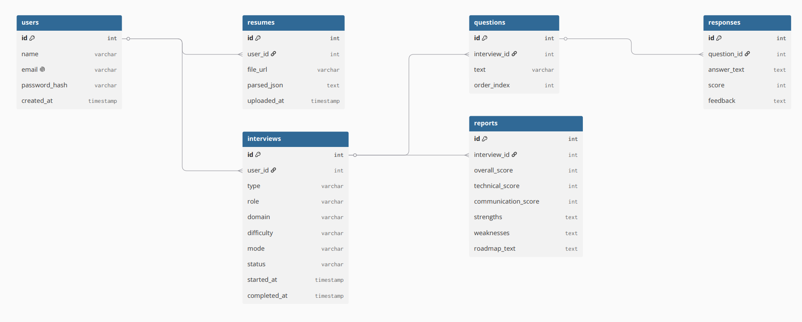

# InterviewForge AI — Database ERD

   Live diagram: [https://dbdiagram.io/d/InterviewForge-ERD-6a6788bf067336e1de04488a]

   

   ## Entities
   - **User** — id, name, email, passwordHash, createdAt
   - **Resume** — id, userId, fileUrl, parsedJson, uploadedAt
   - **Interview** — id, userId, type, role, domain, difficulty, mode, status, startedAt, completedAt
   - **Question** — id, interviewId, text, orderIndex, sourceSkill
   - **Response** — id, questionId, answerText, correctnessScore, communicationScore, structureScore, feedback
   - **Report** — id, interviewId, overallScore, correctnessScore, communicationScore, structureScore, strengths, weaknesses, roadmapText

   ## Relationships
   - User → Resumes (1-to-many)
   - User → Interviews (1-to-many)
   - Interview → Questions (1-to-many)
   - Question → Response (1-to-1)
   - Interview → Report (1-to-1)
